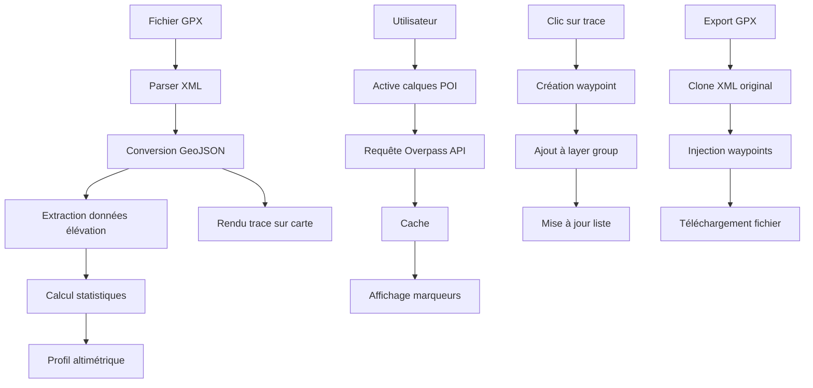

# Lecteur GPX - Carte OpenStreetMap

Application web moderne et complète pour visualiser, éditer et enrichir vos traces GPX avec une interface intuitive et des fonctionnalités avancées.

## 📋 Table des matières

- [Aperçu](#aperçu)
- [Fonctionnalités](#fonctionnalités)
- [Démarrage rapide](#démarrage-rapide)
- [Guide d'utilisation](#guide-dutilisation)
- [Architecture technique](#architecture-technique)
- [Personnalisation](#personnalisation)
- [Contributions](#contributions)
- [Licence](#licence)

## 🎯 Aperçu

Cette application est un lecteur GPX autonome qui fonctionne entièrement dans le navigateur, sans nécessiter de serveur backend. Idéale pour les cyclistes, randonneurs et amateurs d'activités outdoor, elle permet de visualiser des traces GPS, d'ajouter des waypoints personnalisés, et de découvrir les points d'intérêt le long de votre parcours.

### Caractéristiques principales

- ✅ **100% client-side** - Aucun serveur requis, fonctionne hors ligne (après premier chargement)
- 🗺️ **Carte interactive** - Propulsée par Leaflet et OpenStreetMap
- 📊 **Profil altimétrique** - Visualisation des dénivelés avec interactions
- 📍 **Waypoints personnalisés** - Ajoutez vos propres points d'intérêt
- 🏪 **POI OpenStreetMap** - Plus de 20 catégories de points d'intérêt
- 📱 **Responsive** - Interface optimisée mobile et desktop
- 🌍 **Géolocalisation** - Suivi de position en temps réel
- 💾 **Import/Export** - Support complet du format GPX

## 🚀 Fonctionnalités

### 1. Gestion des traces GPX

#### Import de traces
- **Drag & drop** - Glissez-déposez votre fichier GPX n'importe où
- **Sélection de fichier** - Bouton d'import classique
- **Validation automatique** - Détection des fichiers invalides
- **Extraction intelligente** - Récupération du nom de trace depuis les métadonnées GPX

#### Export enrichi
- **Ajout de waypoints** - Exportez votre trace avec les waypoints ajoutés
- **Nom personnalisable** - Renommez votre fichier avant export
- **Format standard** - Fichiers GPX compatibles avec tous les outils GPS

### 2. Profil altimétrique interactif

- **Graphique dynamique** - Visualisation canvas haute performance
- **Statistiques complètes** :
  - Distance totale
  - Dénivelé positif (D+) et négatif (D-)
  - Altitude min/max et moyenne
  - Nombre de points
- **Interaction souris** - Survol pour voir les détails à chaque point
- **Marqueur synchronisé** - Position affichée sur la carte
- **Réductible** - Maximisez l'espace carte si nécessaire

### 3. Waypoints personnalisés

#### Création
- **Clic sur trace** - Ajoutez un waypoint en cliquant sur votre parcours
- **Nommage personnalisé** - Donnez un nom significatif à chaque point
- **Numérotation automatique** - "Waypoint 1, 2, 3..." par défaut

#### Gestion
- **Liste organisée** - Vue d'ensemble de tous vos waypoints
- **Édition rapide** - Modifiez le nom via popup
- **Centrage carte** - Naviguez rapidement vers chaque point
- **Suppression** - Individuelle ou globale

### 4. Calques POI OpenStreetMap

#### Catégories disponibles (20+)

**Services vélo** 🚴
- Stations de réparation
- Magasins de vélo

**Ressources** 💧
- Points d'eau potable

**Hébergement outdoor** 🏕️
- Campings
- Bivouacs autorisés
- Refuges
- Refuges alpins

**Hébergement classique** 🏨
- Hôtels
- Auberges de jeunesse
- Chambres d'hôtes

**Sanitaires** 🚻
- Toilettes publiques
- Douches

**Alimentation** 🛒
- Supermarchés
- Épiceries

**Restauration** 🍴
- Restaurants
- Cafés
- Fast-foods

**Santé** 💊
- Pharmacies
- Hôpitaux

**Patrimoine** 🏛️
- Cimetières

#### Fonctionnalités POI

- **Presets intelligents** - Profils prédéfinis ("J'ai besoin d'eau", "J'ai besoin de manger", etc.)
- **Recherche en temps réel** - Chargement automatique selon la vue carte
- **Limitation intelligente** - Évite la surcharge (500 POI max)
- **Cache performant** - Réduit les requêtes réseau
- **Popups détaillées** - Informations complètes (horaires, téléphone, site web, services)
- **Icônes colorées** - Identification rapide par catégorie
- **Filtrage par zoom** - Affichage progressif selon le niveau de zoom

### 5. Géolocalisation en temps réel

- **Position actuelle** - Marqueur animé avec cercle de précision
- **Actualisation automatique** - Mise à jour toutes les 30 secondes
- **Centrage automatique** - Suivi de votre déplacement
- **Économie de batterie** - Pause automatique en arrière-plan
- **Indicateur de précision** - Visual de la qualité du signal GPS

### 6. Interface utilisateur

#### Desktop
- **Panneau latéral** - 460px de largeur, sections collapsibles
- **Carte plein écran** - Maximum d'espace pour la visualisation
- **Profil altimétrique** - Panneau inférieur réductible
- **Indicateurs centrés** - Messages de statut non-intrusifs

#### Mobile
- **Panneau coulissant** - Accès via bouton hamburger
- **Plein écran** - Optimisation pour petits écrans
- **Tactile optimisé** - Boutons et zones de touch agrandis
- **Orientation adaptative** - Support portrait et paysage

## 🎬 Démarrage rapide

### Installation

1. **Téléchargez le fichier HTML**
   ```bash
   wget https://[votre-repo]/index_mobile_portrait_ready.html
   ```

2. **Ouvrez dans votre navigateur**
   ```bash
   # Option 1 : Double-clic sur le fichier
   
   # Option 2 : Serveur local (recommandé pour développement)
   python -m http.server 8000
   # Puis ouvrez http://localhost:8000
   ```

3. **C'est tout !** L'application est prête à l'emploi.

### Première utilisation

1. **Importez un fichier GPX**
   - Cliquez sur "Importer GPX" ou glissez-déposez votre fichier
   - La trace s'affiche automatiquement sur la carte

2. **Explorez les POI**
   - Activez les catégories qui vous intéressent
   - Ou utilisez un preset : "J'ai besoin d'eau", etc.
   - Zoomez pour voir apparaître les POI

3. **Ajoutez des waypoints**
   - Cliquez sur votre trace pour placer un waypoint
   - Nommez-le et validez

4. **Exportez**
   - Cliquez sur "Exporter GPX"
   - Votre fichier inclut maintenant vos waypoints

## 📖 Guide d'utilisation

### Raccourcis clavier

| Touche | Action |
|--------|--------|
| `Échap` | Fermer le panneau latéral (mobile) |

### Gestes tactiles (mobile)

| Geste | Action |
|-------|--------|
| Pincer | Zoomer/Dézoomer |
| Glisser | Déplacer la carte |
| Double-tap | Zoomer |
| Tap sur trace | Ajouter waypoint |

### Optimisations de performance

#### Cache POI
- **TTL** : 10 minutes
- **Limite** : 15 zones en cache
- **Stratégie** : LRU (Least Recently Used)

#### Rendu
- **Simplification** : Profil altimétrique limité à 1500 points
- **Throttling** : Requêtes POI espacées de 1,5s minimum
- **Debounce** : Rechargement POI après 2s de stabilité

#### Limites
- **POI total** : 500 maximum affichés
- **POI par catégorie** : 120 maximum
- **Zone maximale** : 0,12° carrés (zoom minimum 11-13 selon catégorie)

### Personnalisation des POI

Vous pouvez facilement ajouter vos propres catégories de POI en modifiant l'objet `POI_CATEGORIES` dans le code :

```javascript
my_custom_poi: {
  id: 'my_custom_poi',
  label: 'Mon POI personnalisé',
  icon: '🏷️',
  color: '#FF00FF',
  group: 'heritage', // Groupe parent existant
  tags: { amenity: 'my_tag' }, // Tags OSM
  priority: 'medium',
  minZoom: 12
}
```

## 🏗️ Architecture technique

### Technologies utilisées

| Technologie | Version | Usage |
|-------------|---------|-------|
| [Leaflet](https://leafletjs.com/) | 1.9.4 | Cartographie interactive |
| [OpenStreetMap](https://www.openstreetmap.org/) | - | Tuiles de carte |
| [Overpass API](https://overpass-api.de/) | - | Requêtes POI |
| Vanilla JavaScript | ES6+ | Logique applicative |
| CSS3 | - | Styles et animations |

### Structure du code

```
index_mobile_portrait_ready.html
├── <head>
│   ├── Leaflet CSS
│   ├── Styles personnalisés
│   │   ├── Variables CSS (couleurs, espacements)
│   │   ├── Composants UI
│   │   ├── Responsive breakpoints
│   │   └── Animations
│   └── Overrides compacts/modernes
│
├── <body>
│   ├── Panneau latéral (.tools-panel)
│   │   ├── En-tête
│   │   ├── Section géolocalisation
│   │   ├── Section fichier GPX
│   │   ├── Section calques POI
│   │   ├── Section waypoints
│   │   └── Section informations
│   │
│   └── Conteneur carte (.map-container)
│       ├── Carte Leaflet (#map)
│       ├── Bouton refresh POI
│       ├── Indicateurs overlay
│       └── Profil altimétrique
│
└── <script>
    ├── Conversion GPX ↔ GeoJSON
    ├── Gestionnaire POI
    │   ├── Configuration (catégories, presets)
    │   ├── Cache et throttling
    │   ├── Requêtes Overpass
    │   └── Rendu marqueurs
    ├── Gestionnaire waypoints
    ├── Gestionnaire élévation
    ├── Gestionnaire géolocalisation
    └── Gestionnaire UI (panneau, drag&drop)
```

### Flux de données



### API Overpass

L'application utilise trois endpoints Overpass avec rotation automatique :

1. `https://overpass-api.de/api/interpreter`
2. `https://overpass.kumi.systems/api/interpreter`
3. `https://overpass.openstreetmap.fr/api/interpreter`

**Exemple de requête générée** :

```overpass
[out:json][timeout:25][bbox:48.8,2.3,48.9,2.4];
(
  node["amenity"="drinking_water"];
  way["amenity"="drinking_water"];
  relation["amenity"="drinking_water"];
);
out center;
```

## 🎨 Personnalisation

### Thème de couleurs

Modifiez les variables CSS dans la section `:root` :

```css
:root {
  --color-primary: #0066FF;        /* Couleur principale */
  --color-primary-hover: #0052CC;  /* Hover état */
  --color-danger: #FF3B30;         /* Erreurs/suppressions */
  --color-background: #FFFFFF;     /* Fond principal */
  --color-text-primary: #1A1A1A;   /* Texte principal */
  /* ... */
}
```

### Ajout de presets POI

Ajoutez vos propres presets dans `LAYER_PRESETS` :

```javascript
my_custom_preset: {
  label: "Mon besoin personnalisé",
  icon: '⭐',
  categories: [
    'drinking_water',
    'toilets',
    'bicycle_repair'
  ]
}
```

### Configuration des limites

Ajustez `POI_SETTINGS` selon vos besoins :

```javascript
const POI_SETTINGS = {
  debounceMs: 2000,           // Délai avant rechargement POI
  maxTotalItems: 500,         // Limite globale POI
  maxItemsPerCategory: 120,   // Limite par catégorie
  cacheTtlMs: 10 * 60 * 1000, // Durée de vie cache
  requestTimeoutMs: 12000     // Timeout requêtes
};
```

## 🤝 Contributions

Les contributions sont les bienvenues ! Voici comment participer :

### Rapporter un bug

Créez une issue avec :
- Description détaillée du problème
- Étapes de reproduction
- Navigateur et version
- Capture d'écran si pertinent

### Proposer une fonctionnalité

Ouvrez une discussion avec :
- Description de la fonctionnalité
- Cas d'usage
- Mockups si disponibles

### Soumettre une Pull Request

1. Forkez le projet
2. Créez une branche (`git checkout -b feature/AmazingFeature`)
3. Committez vos changements (`git commit -m 'Add AmazingFeature'`)
4. Pushez vers la branche (`git push origin feature/AmazingFeature`)
5. Ouvrez une Pull Request

### Guidelines de code

- **JavaScript** : ES6+, préférer const/let, documenter les fonctions complexes
- **CSS** : Utiliser les variables CSS, mobile-first approach
- **Commits** : Messages clairs en français ou anglais

## 📝 Crédits et attribution

### Données cartographiques

- **OpenStreetMap** © [OpenStreetMap contributors](https://www.openstreetmap.org/copyright)
- **Données POI** via [Overpass API](https://overpass-api.de/)

### Bibliothèques

- [Leaflet](https://leafletjs.com/) - BSD 2-Clause License
- [Leaflet PolylineDecorator](https://github.com/bbecquet/Leaflet.PolylineDecorator) - MIT License

### Icônes

Emojis Unicode pour une compatibilité maximale

## 📄 Licence

Ce projet est sous licence MIT. Voir le fichier `LICENSE` pour plus de détails.

```
MIT License

Copyright (c) 2025

Permission is hereby granted, free of charge, to any person obtaining a copy
of this software and associated documentation files (the "Software"), to deal
in the Software without restriction, including without limitation the rights
to use, copy, modify, merge, publish, distribute, sublicense, and/or sell
copies of the Software, and to permit persons to whom the Software is
furnished to do so, subject to the following conditions:

The above copyright notice and this permission notice shall be included in all
copies or substantial portions of the Software.

THE SOFTWARE IS PROVIDED "AS IS", WITHOUT WARRANTY OF ANY KIND, EXPRESS OR
IMPLIED, INCLUDING BUT NOT LIMITED TO THE WARRANTIES OF MERCHANTABILITY,
FITNESS FOR A PARTICULAR PURPOSE AND NONINFRINGEMENT. IN NO EVENT SHALL THE
AUTHORS OR COPYRIGHT HOLDERS BE LIABLE FOR ANY CLAIM, DAMAGES OR OTHER
LIABILITY, WHETHER IN AN ACTION OF CONTRACT, TORT OR OTHERWISE, ARISING FROM,
OUT OF OR IN CONNECTION WITH THE SOFTWARE OR THE USE OR OTHER DEALINGS IN THE
SOFTWARE.
```

## ❓ FAQ

### L'application nécessite-t-elle une connexion internet ?

Oui, pour :
- Charger les tuiles de carte
- Récupérer les POI OpenStreetMap
- Géolocalisation (selon appareil)

Non pour :
- Afficher une trace déjà chargée
- Manipuler les waypoints
- Exporter le GPX

### Mes données sont-elles envoyées à un serveur ?

Non. Tout le traitement se fait localement dans votre navigateur. Seules les requêtes suivantes sont effectuées :
- Chargement des tuiles OpenStreetMap
- Requêtes Overpass API pour les POI
- Géolocalisation HTML5 (selon paramètres appareil)

### Puis-je utiliser l'application sur mobile ?

Oui ! L'interface est entièrement responsive et optimisée pour mobile. Testée sur :
- iOS Safari (iOS 14+)
- Chrome Android (v90+)
- Firefox Android (v90+)

### Quelle taille de fichier GPX est supportée ?

L'application peut théoriquement gérer des traces de plusieurs milliers de points, mais pour des performances optimales :
- **Recommandé** : < 5000 points
- **Maximum testé** : 15000 points

Le profil altimétrique est automatiquement simplifié à 1500 points pour maintenir la fluidité.

### Comment ajouter mes propres catégories de POI ?

Consultez la section [Personnalisation des POI](#personnalisation-des-poi) dans ce README.

---

**Développé avec ❤️ pour la communauté outdoor**

[⬆ Retour en haut](#lecteur-gpx---carte-openstreetmap)