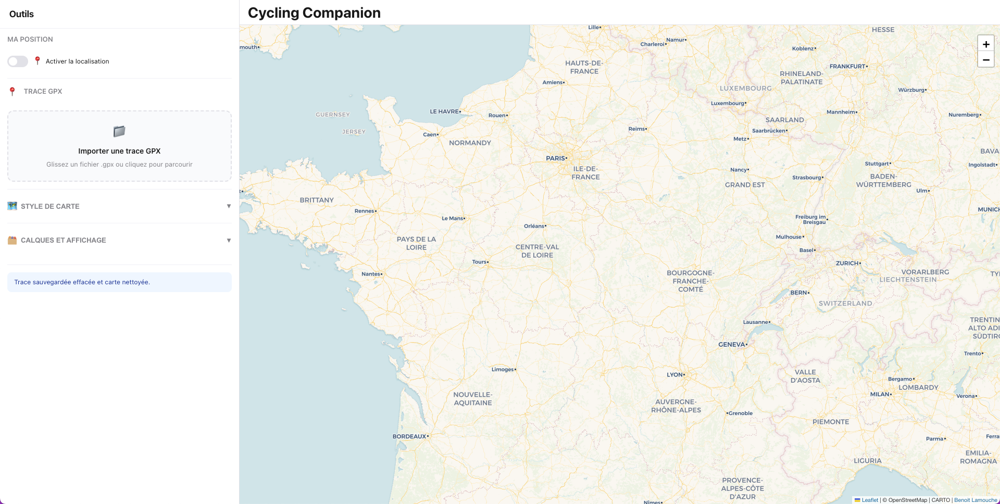

# 🚴 Cycling Companion - Planificateur Bikepacking

[](https://opensource.org/licenses/MIT)
[](https://blamouche.github.io/bikepacking-gpx-manager/)
[](https://github.com/blamouche/bikepacking-gpx-manager)
[](https://twitter.com/blamouche)

**Outil gratuit et open source de planification d'itinéraires pour le bikepacking et le cyclotourisme**

🔗 **[🚀 Lancer l'application](https://blamouche.github.io/bikepacking-gpx-manager/)**

---



*Interface complète : trace GPX avec profil d'élévation interactif, waypoints personnalisés et points d'intérêt*

---

## ✨ Fonctionnalités principales

### 📍 Gestion complète de traces GPX

- ✅ **Import/Export GPX** : Compatibilité totale avec Komoot, Strava, Garmin, Wahoo, Suunto
- 🗺️ **Visualisation interactive** : Cartes CyclOSM, OpenStreetMap, OpenTopoMap, satellite
- 📊 **Profil d'élévation détaillé** : Statistiques D+/D-, altitude min/max, distance
- ➡️ **Flèches directionnelles** : Sens de parcours clairement indiqué sur la trace
- 🎯 **Markers début/fin** : Points de départ et d'arrivée automatiquement affichés

### 🎯 Waypoints et Roadbook

- 📍 **Création intuitive** : Cliquez sur la trace pour ajouter des points d'étape
- ✏️ **Noms personnalisables** : Renommez vos waypoints (restaurant, camping, point de vue...)
- 📋 **Roadbook automatique** : Génération d'un carnet de route avec :
  - Distances cumulées depuis le départ
  - Distances entre chaque étape
  - Distance restante jusqu'à l'arrivée
  - D+ (dénivelé positif) restant
  - Altitude de chaque point
- 💾 **Export enrichi** : Téléchargez votre GPX avec tous vos waypoints inclus
- 📄 **Copie texte** : Copiez le roadbook au format texte pour l'imprimer ou le partager

### 🗺️ Points d'intérêt (POI) en temps réel

Trouvez facilement tous les services le long de votre parcours :

#### 💧 Ressources essentielles
- **Eau potable** : Fontaines publiques
- **Cimetières** : Source gratuite d'eau (robinets extérieurs)

#### 🛒 Alimentation
- **Supermarchés** et **épiceries** : Ravitaillement complet
- **Restaurants**, **cafés**, **fast-food** : Restauration sur place

#### 🏕️ Hébergement outdoor
- **Campings** : Officiels et aménagés
- **Bivouacs autorisés** : Zones de camping sauvage légales
- **Refuges** : De montagne et alpins
- **Refuges non gardés** : Abris gratuits

#### 🏨 Hébergement confort
- **Hôtels**, **auberges de jeunesse**, **chambres d'hôtes**

#### 🔧 Services vélo
- **Stations de réparation** : Bornes self-service
- **Magasins de vélo** : Pièces détachées et assistance

#### 🚻 Hygiène
- **Toilettes publiques** et **douches**

#### 💊 Santé
- **Pharmacies** et **hôpitaux**

**🎨 Profils prédéfinis** : "J'ai besoin d'eau", "J'ai besoin de manger", "J'ai besoin de réparer", etc.

### 🎨 Interface moderne et intuitive

- 📱 **Responsive design** : Fonctionne parfaitement sur mobile, tablette et desktop
- 🌙 **Interface épurée** : Design moderne et lisible
- 📍 **Géolocalisation** : Suivez votre position en temps réel sur la trace
- 💾 **Sauvegarde automatique** : Vos données restent dans votre navigateur (confidentialité totale)
- 🔄 **Sections collapsibles** : Interface personnalisable selon vos besoins
- ⚡ **Performances optimisées** : Chargement rapide, scroll fluide

### 📱 Application Web Progressive (PWA)

- 📲 **Installable** : Ajoutez l'app à votre écran d'accueil (iOS/Android)
- ⚡ **Hors ligne** : Consultez vos traces même sans connexion internet
- 🚀 **Pas de store** : Aucune installation via App Store/Play Store requise

---

## 🚀 Utilisation rapide

### 1️⃣ Importer une trace

- 📁 **Glissez-déposez** votre fichier `.gpx` ou cliquez pour parcourir
- ⚡ Affichage instantané avec profil d'élévation

### 2️⃣ Explorer et enrichir

- 🗺️ **Naviguez** sur la carte et changez de fond selon vos besoins
- 📍 **Ajoutez des waypoints** : Cliquez sur la trace pour créer des étapes
- 🔍 **Activez les POI** : Cochez les types de points d'intérêt utiles

### 3️⃣ Planifier avec le roadbook

- 📋 Consultez le **roadbook** avec distances et dénivelé
- 📄 **Copiez** le roadbook en texte pour l'imprimer

### 4️⃣ Exporter

- 💾 **Téléchargez** votre GPX enrichi avec waypoints
- 📤 Importez-le dans votre GPS Garmin, Wahoo, application Komoot, etc.

---

## 📱 Installation (PWA)

Cycling Companion peut être installé comme une application native :

### Sur mobile (iOS/Android)

**iOS Safari** :
1. Appuyez sur le bouton **Partager** (carré avec flèche)
2. Sélectionnez **"Sur l'écran d'accueil"**
3. Confirmez

**Android Chrome** :
1. Appuyez sur le menu **⋮** (trois points)
2. Sélectionnez **"Ajouter à l'écran d'accueil"**
3. Confirmez

### Sur desktop (Chrome/Edge/Brave)

1. Cliquez sur l'icône **➕** dans la barre d'adresse
2. Ou menu : **"Installer Cycling Companion"**

**L'application installée fonctionne hors ligne avec vos traces sauvegardées !** ⚡

---

## 🛠️ Technologies

- **[Leaflet.js](https://leafletjs.com/)** - Cartographie interactive
- **[OpenStreetMap](https://www.openstreetmap.org/)** - Données cartographiques libres
- **[CyclOSM](https://www.cyclosm.org/)** - Rendu optimisé pour le cyclisme
- **[Overpass API](https://wiki.openstreetmap.org/wiki/Overpass_API)** - Recherche de POI temps réel
- **Vanilla JavaScript** - Aucune dépendance framework lourde
- **HTML5 / CSS3** - Interface moderne et responsive
- **PWA** - Application web progressive installable

---

## 💻 Installation locale

```bash
# Cloner le repository
git clone https://github.com/blamouche/bikepacking-gpx-manager.git
cd bikepacking-gpx-manager

# Ouvrir directement index.html dans votre navigateur
# Ou lancer un serveur local :

# Option 1 : Python
python -m http.server 8000

# Option 2 : Node.js (npx)
npx serve -s . -p 8000

# Option 3 : PHP
php -S localhost:8000

# Puis ouvrir : http://localhost:8000
```

---

## 🤝 Contribution

Les contributions sont les bienvenues ! 🎉

### Comment contribuer

1. 🍴 **Forkez** le projet
2. 🌿 **Créez une branche** : `git checkout -b feature/amelioration`
3. 💾 **Committez** : `git commit -m 'Ajout nouvelle fonctionnalité'`
4. 📤 **Pushez** : `git push origin feature/amelioration`
5. 🔃 **Pull Request** : Ouvrez une PR avec description détaillée

### Idées de contributions

- 🐛 **Signaler des bugs** : Ouvrir une [issue](https://github.com/blamouche/bikepacking-gpx-manager/issues)
- 💡 **Proposer des fonctionnalités** : Partager vos idées
- 🌍 **Traductions** : Ajouter d'autres langues (EN, ES, DE, IT...)
- 📖 **Documentation** : Améliorer le README ou ajouter des tutoriels
- 🎨 **Design** : Proposer des améliorations UI/UX
- ⚡ **Performance** : Optimisations code

---

## 📄 Licence

**MIT** © [Benoit Lamouche](https://lamouche.fr)

Vous êtes libre d'utiliser, modifier et distribuer ce projet. Voir [LICENSE](LICENSE) pour plus de détails.

---

## 🙏 Remerciements

- 🗺️ Données © [OpenStreetMap contributors](https://www.openstreetmap.org/copyright)
- 🚴 Style CyclOSM © [CyclOSM team](https://www.cyclosm.org/)
- 🌍 OpenTopoMap © [OpenTopoMap](https://opentopomap.org/)
- 🛰️ Esri Imagery © [Esri](https://www.esri.com/)
- 📚 Documentation Leaflet © [Leaflet team](https://leafletjs.com/)

---

## 📞 Contact & Support

- 🌐 **Site web** : [lamouche.fr](https://lamouche.fr)
- 🐦 **Twitter** : [@blamouche](https://twitter.com/blamouche)
- 💼 **GitHub** : [@blamouche](https://github.com/blamouche)
- 📧 **Email** : (disponible sur le site web)

### Support

- 💬 **Questions** : Ouvrir une [Discussion](https://github.com/blamouche/bikepacking-gpx-manager/discussions)
- 🐛 **Bugs** : Ouvrir une [Issue](https://github.com/blamouche/bikepacking-gpx-manager/issues)
- ⭐ **Vous aimez ?** : Donnez une étoile au projet !

---

## 🗺️ Roadmap & Fonctionnalités futures

- [ ] 🌍 **Multilingue** : Interface EN/ES/DE/IT
- [ ] 🌙 **Mode sombre** : Thème adapté à la nuit
- [ ] 📊 **Graphiques avancés** : Analyse détaillée du parcours
- [ ] 🗓️ **Planification multi-jours** : Découpage automatique en étapes
- [ ] 🧭 **Navigation turn-by-turn** : Guidage pas à pas
- [ ] 📸 **Photos géolocalisées** : Ajout d'images sur la trace
- [ ] ☁️ **Sync cloud (optionnel)** : Sauvegarde en ligne
- [ ] 🏆 **Badges et défis** : Gamification

---

## 📈 Statistiques


---

**⭐ Si ce projet vous est utile, n'hésitez pas à lui donner une étoile ! ⭐**

**🚴 Bon bikepacking ! 🏕️**
