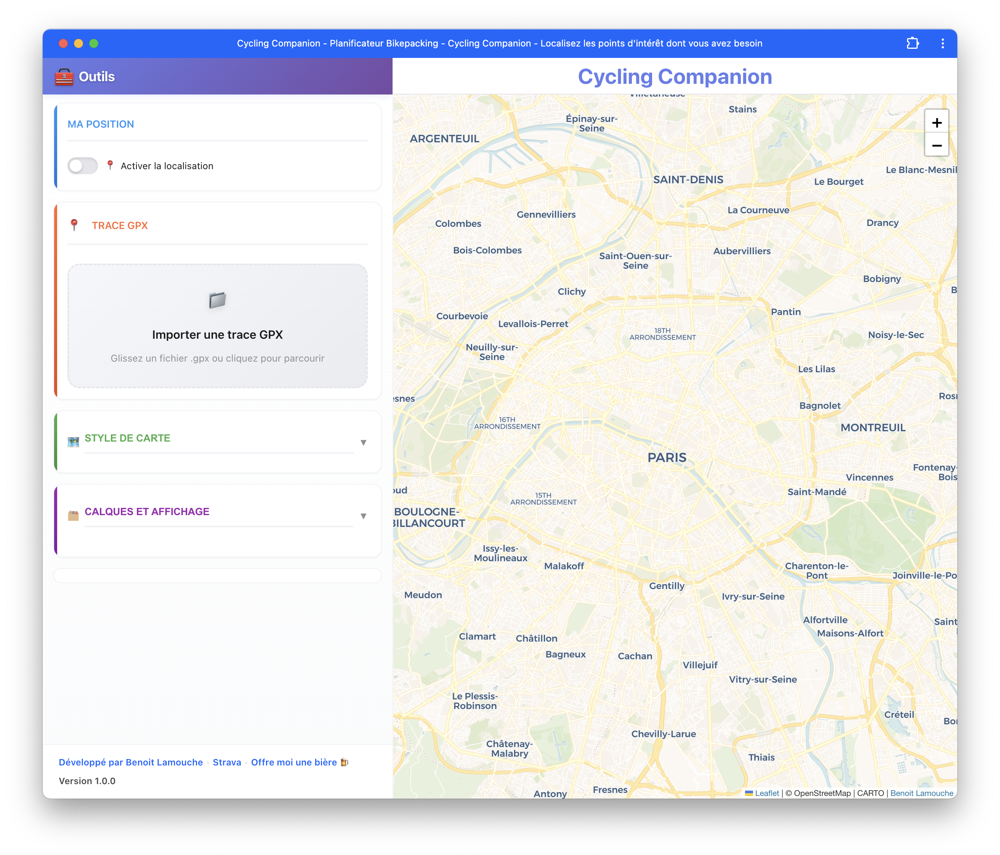

# 🚴 Cycling Companion - Planificateur Bikepacking

[](https://opensource.org/licenses/MIT)
[](https://cyclingcompanion.lamouche.fr/)
[](https://github.com/blamouche/bikepacking-gpx-manager)
[](https://twitter.com/blamouche)

**Outil gratuit et open source de planification d'itinéraires pour le bikepacking et le cyclotourisme**

🔗 **[🚀 Lancer l'application](https://cyclingcompanion.lamouche.fr/)**

---



*Interface complète : trace GPX, profil d'élévation interactif, roadbook auto et POI en temps réel*

---

## Aperçu

Cycling Companion vous accompagne de la préparation à l'itinérance :

- Importez vos traces GPX et visualisez les statistiques clés en un clin d'œil
- Enrichissez votre parcours avec un roadbook dynamique et des waypoints personnalisés
- Trouvez instantanément les points d'eau, commerces, hébergements ou ateliers vélo autour de votre trace
- Travaillez hors ligne, sans compte ni partage de données : tout reste dans votre navigateur

---

## Nouveautés 2025

- ✅ **Bouton de visibilité de la trace** : maintenez-le enfoncé pour masquer temporairement la trace GPX et lire la carte sans surcharges
- ✅ **Sélecteur de styles de carte repensé** : galerie avec aperçus (Voyager, CyclOSM, OSM, OpenTopo, Esri Satellite & Hybrid) et mémorisation automatique
- ✅ **Géolocalisation temps réel** : activez le suivi, visualisez votre précision et recentrez-vous en un clic
- ✅ **Panneau latéral adaptatif** : sections repliables, compteur de couches actives et navigation mobile optimisée

---

## Fonctionnalités principales

### 📍 Gestion avancée des traces GPX

- Importez par glisser-déposer ou sélection de fichier, support complet Komoot / Strava / Garmin / Wahoo / Suunto
- Affichez le profil altimétrique interactif, les stats D+/D-, vitesses moyennes, altitudes min/max, distances
- Identifiez immédiatement départ, arrivée et sens de parcours grâce aux marqueurs dédiés
- Exportez votre trace enrichie (waypoints, POI) en une seconde

### 🎯 Waypoints et Roadbook intelligent

- Ajoutez des étapes d'un simple clic sur la trace, renommez-les, classez-les par type
- Roadbook automatique avec distances cumulées, segment, distance restante, altitude et D+ restant
- Centrez la carte sur une étape depuis le roadbook et copiez l'ensemble en texte pour partager/imprimer

### 🗺️ Points d'intérêt en direct

- Recherche Overpass API optimisée pour le bikepacking : eau, alimentation, hygiène, hébergements, réparations, santé
- Profils rapides (ex. « besoin d'eau », « manger », « réparer ») pour afficher les bonnes catégories en un clic
- Compteur de POI par catégorie et affichage par groupes pour garder la carte lisible

### 🧭 Navigation & carte

- Bouton press-and-hold pour masquer la trace GPX et inspecter la cartographie en détail
- Galerie de styles de carte avec vignettes : CyclOSM, OpenStreetMap, CARTO Voyager, OpenTopoMap, Esri Satellite/Hybrid
- Suivi de votre position, cercle de précision, recentrage instantané et historique de verrouillage
- Gestion fine des couches (POI, géolocalisation, tracé) via un panneau latéral responsive et mémorisation locale

### 🌐 Expérience PWA

- Application installable (mobile & desktop) fonctionnant hors ligne
- Préchargement des ressources critiques, performances optimisées et UI responsive
- Sauvegarde automatique de la trace, des waypoints et de vos préférences dans `localStorage`
- Aucune création de compte, aucun tracking : vos données restent en local

---

## Prise en main rapide

1. **Importer** : déposez un `.gpx` ou utilisez le bouton « Importer ». La trace, la carte et le profil d'élévation se synchronisent instantanément.
2. **Explorer** : activez les catégories de POI utiles, changez de style de carte et utilisez le bouton de visibilité pour inspecter les détails.
3. **Planifier** : ajoutez des waypoints sur les points d'intérêt repérés, le roadbook s'enrichit automatiquement.
4. **Exporter & partager** : téléchargez la trace enrichie ou copiez le roadbook en texte pour votre équipe de route.

---

## Vie privée & stockage

- Les traces, waypoints, préférences de couches et style de carte sont conservés dans `localStorage`
- Aucun envoi serveur ni analytics : le projet respecte le principe « vos données, votre navigateur »
- Supprimez tout en un clic via l'interface (« Réinitialiser ») si vous changez de parcours

---

## Installation comme PWA

### Mobile (iOS Safari)

1. Ouvrez [cyclingcompanion.lamouche.fr](https://cyclingcompanion.lamouche.fr/)
2. Touchez **Partager**
3. Sélectionnez **« Sur l'écran d'accueil »**
4. Validez, l'app se comporte comme une application native

### Mobile (Android Chrome)

1. Ouvrez l'application web
2. Menu ⋮ → **Installer l'application**
3. Confirmez pour créer le raccourci et activer le mode hors ligne

### Desktop (Chrome / Edge / Brave)

1. Cliquez sur l'icône **➕ Installer** dans la barre d'adresse
2. Ou via le menu du navigateur → **Installer Cycling Companion**

L'application installée reste disponible hors ligne avec vos traces sauvegardées.

---

## Installation locale

```bash
# Cloner le dépôt
git clone https://github.com/blamouche/bikepacking-gpx-manager.git
cd bikepacking-gpx-manager

# Option rapide : ouvrir index.html dans votre navigateur

# Ou lancer un petit serveur local
python -m http.server 8000         # Python
npx serve -s . -p 8000             # Node.js
php -S localhost:8000              # PHP

# Puis visiter http://localhost:8000
```

---

## Stack technique

- **Leaflet.js** pour la cartographie interactive et les contrôles personnalisés
- **OpenStreetMap / CyclOSM / OpenTopoMap / Esri** comme fournisseurs de tuiles
- **Overpass API** pour la recherche de points d'intérêt ciblée bikepacking
- **Vanilla JavaScript + HTML5/CSS3** pour une interface performante et légère
- **Service Worker + Manifest** pour les capacités PWA hors ligne

---

## Contribution

1. 🍴 Forkez le projet
2. 🌿 Créez une branche : `git checkout -b feature/amelioration`
3. 💾 Commitez : `git commit -m 'Ajout nouvelle fonctionnalité'`
4. 📤 Pushez : `git push origin feature/amelioration`
5. 🔃 Ouvrez une Pull Request bien documentée

Idées bienvenues : corrections de bugs, nouvelles catégories de POI, optimisation performances, traduction de l'UI, tutoriels d'utilisation.

---

## Contact & support

- 🌐 [lamouche.fr](https://lamouche.fr)
- 🐦 [@blamouche](https://twitter.com/blamouche)
- 💼 [github.com/blamouche](https://github.com/blamouche)

Support :

- 💬 Questions : [Discussions GitHub](https://github.com/blamouche/bikepacking-gpx-manager/discussions)
- 🐛 Bugs : [Issues GitHub](https://github.com/blamouche/bikepacking-gpx-manager/issues)
- ⭐ Vous aimez ? Ajoutez une étoile au dépôt !

---

## Roadmap

- [x] Bouton press-and-hold pour masquer la trace GPX
- [x] Galerie de styles de carte avec mémorisation
- [x] Géolocalisation continue et recentrage
- [ ] Interface multilingue (EN / ES / DE / IT)
- [ ] Mode sombre pour utilisation nocturne
- [ ] Planification multi-jours avec étapes automatiques
- [ ] Navigation turn-by-turn et indications audio
- [ ] Export avancé (CSV/GPX segmentés, PDF roadbook)

---

## Licence & remerciements

- Licence **MIT** © [Benoit Lamouche](https://lamouche.fr) — voir [LICENSE](LICENSE)
- Données cartographiques © [OpenStreetMap contributors](https://www.openstreetmap.org/copyright)
- Styles CyclOSM © [CyclOSM](https://www.cyclosm.org/) • OpenTopoMap © [OpenTopoMap](https://opentopomap.org/) • Imagerie © [Esri](https://www.esri.com/)

---

**🚴 Bon bikepacking & belle planification !**
